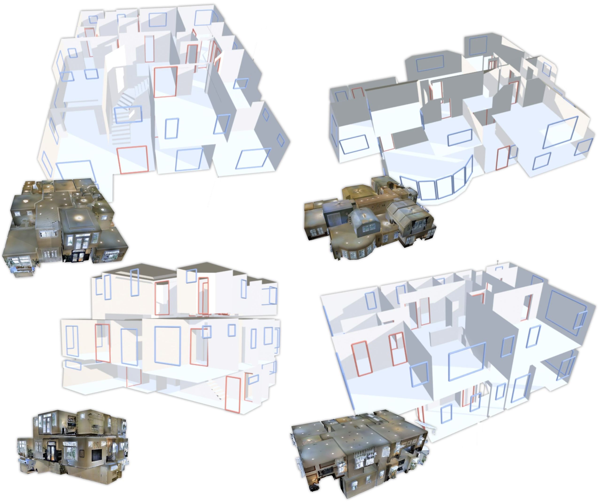

# HouseLayout3D: A Benchmark Dataset for 3D Layout Estimation in the Wild


**HouseLayout3D** is a challenging benchmark dataset for **3D layout estimation in large-scale, multi-floor buildings**. It is built upon real-world building scans from [Matterport3D](https://niessner.github.io/Matterport/), and provides detailed annotations of structural elements across up to five floors and forty rooms per building. The dataset is designed to support research in scene understanding, indoor mapping, and robotics applications that require vectorized, object-free representations of indoor spaces.



## Why HouseLayout3D?

Most existing datasets and models for 3D layout estimation are tailored for small-scale, single-room scenes. These models, while effective on synthetic or room-scale data, fail to generalize to larger, multi-level buildings. HouseLayout3D addresses this gap by providing:

- **Real-world, complex architectural spaces**, including open-plan layouts, staircases, and multi-floor transitions with up to **5 floors** and **40+ rooms**.
- **Detailed structural annotations**, including walls, floors, ceilings, doors, windows, and stairs.

## What’s in the Dataset?

- Vectorized layout annotations of structures (ceilings, walls, floors) as 3D polygons.
- Annotations of windows and doors (including opening direction) as 3D rectangles.
- Annotations of stairs as 3D polygons.

## Getting Started

Follow these steps to set up the environment and visualize a scene from the dataset.

### 1. Installation

```bash
# Clone the evaluation repo
git clone https://github.com/valebi/house-layout-3d-eval.git
cd house-layout-3d-eval

# Create and activate a conda environment
conda create -n house-layout3d python=3.9 -y
conda activate house-layout3d

# Install dependencies
pip install -r requirements.txt
```

### 2. Run the Visualizer

First, download the dataset and place it in your desired `DATASET_ROOT` directory.

Then run the visualization script with:

```bash
python visualize.py --dataset-root DATASET_ROOT --scene JmbYfDe2QKZ
```


## Data Structure
```text
HouseLayout3D/
├── structures/
│   ├── {scene}.obj
│   │   → Base layout as a triangle mesh (without doors or windows)
│   └── layouts_split_by_entity/
│       └── {scene}/*.obj
│           → Individual wall / ceiling / floor entities (jointly compose the base layout)
├── doors/
│   └── {scene}.json
│       → Door annotations: each door is a list of 4 corners. The "normal" field indicates opening direction.
├── windows/
│   └── {scene}.json
│       → Window annotations: each window is a list of 4 corners.
├── stairs/
│   └── {scene}/*.ply
│       → Stair annotations as polygonal surfaces that follow the steps (steps themselves are part of the base layout)
├── poses/
│   └── {scene}.json
│       → The camera poses & intrinsics used for evaluation of the layout depth in nerfstudio format
```